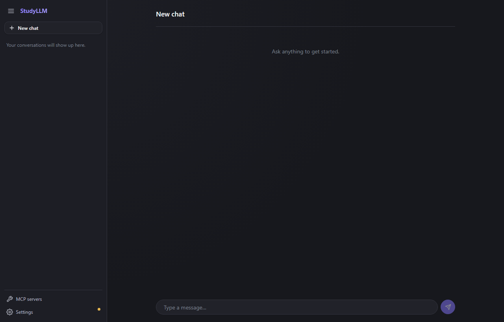
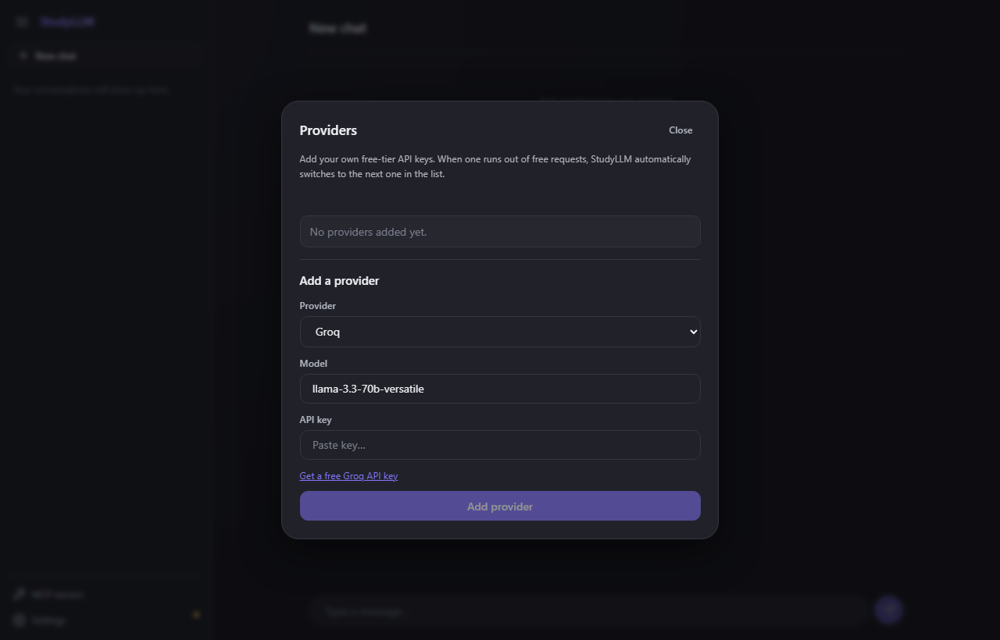
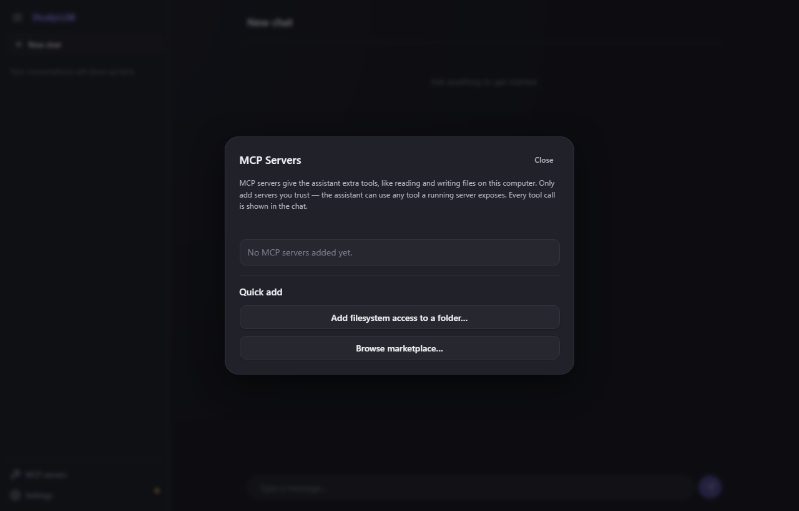
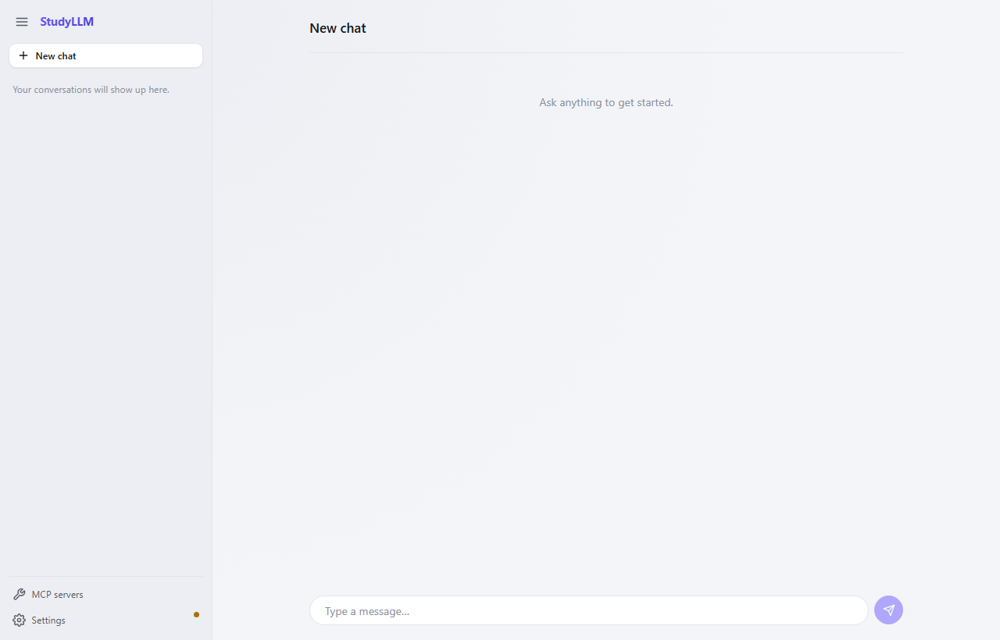

<div align="center">

# StudyLLM

**A free AI chat app for students — bring your own free API keys, no subscription needed.**



[](https://github.com/rotkiv93/studyllm/releases/latest)
[](https://github.com/rotkiv93/studyllm/releases/latest)

*Installers are published automatically to the [Releases page](https://github.com/rotkiv93/studyllm/releases) whenever a new version ships. No release has been cut yet — check back soon, or build it yourself using the instructions further down.*

</div>

---

## What is StudyLLM?

Paid AI subscriptions add up fast when you're a student. Most AI providers give away a generous
free tier though — you just have to sign up and grab an API key. **StudyLLM is a chat app that
lets you use those free keys directly**, so you get a full AI chat experience without paying
anyone a monthly fee.

It runs as a normal desktop app on Windows and macOS — no browser tab, no account, nothing stored
on someone else's server. Your conversations stay on your own computer.

## Why you'll like it

- 🆓 **Actually free** — use free API keys from providers like Groq or Cerebras instead of paying
  for ChatGPT Plus or Claude Pro.
- 🔄 **Never gets stuck on "rate limit exceeded"** — add more than one provider and StudyLLM
  automatically switches to the next one the moment one runs dry.
- 🔒 **Private by default** — your keys live in your operating system's secure keychain, and your
  chats go straight from your computer to the AI provider. Nothing passes through a StudyLLM
  server, because there isn't one.
- 🛠️ **Give the AI real tools** — let it read and write files in a folder you choose, so it can
  actually help with your notes, essays, and projects instead of just talking about them.
- 🛍️ **A built-in store for AI tools** — browse and install more capabilities for the AI with a
  couple of clicks.
- 🌗 **Looks good day or night** — automatically follows your system's light or dark theme.
- 💻 **Cross-platform** — Windows, macOS, and Linux.

---

## A closer look

<table>
<tr>
<td width="50%">

### Add your own keys, for free
Open Settings, paste in a free API key from a provider like Groq, and you're chatting — no card,
no account with StudyLLM itself.

</td>
<td width="50%">



</td>
</tr>
<tr>
<td width="50%">

### Give the AI tools to work with
Turn on filesystem access to a folder, or browse the marketplace for more tools — the AI can then
read and write real files while you chat, with every action shown transparently in the
conversation.

</td>
<td width="50%">



</td>
</tr>
</table>

<div align="center">

**Light mode**



</div>

---

## Getting started (as a user)

1. **Download** the installer for your OS from the badges above.
2. **Install and open** StudyLLM like any other app.
3. Click **Settings**, pick a provider (Groq and Cerebras both have free tiers that work great
   here), and paste in your API key. Don't have one yet? Each provider link in Settings takes you
   straight to their free key page.
4. Start typing — that's it.
5. *(Optional)* Click **MCP servers** to give the AI access to a folder on your computer, or browse
   the marketplace for more tools.

---

## Status

StudyLLM is under active development. Core chat, provider failover, and MCP tools already work day
to day; polish items like code-signed installers, auto-updates, and a first-run setup wizard are
still in progress. If something looks unfinished, it probably is — check
[`PROJECT_STATUS.md`](./PROJECT_STATUS.md) for the exact state of every feature.

---

## Building it yourself

Prefer to run it from source, or your platform isn't published yet? StudyLLM is built with
[Tauri](https://tauri.app/), React, and Rust.

```bash
git clone https://github.com/rotkiv93/studyllm.git
cd studyllm
npm install
npm run tauri dev    # runs the full desktop app
```

Full command reference, architecture notes, and contributor guidelines live in
[`PROJECT_STATUS.md`](./PROJECT_STATUS.md) and [`CLAUDE.md`](./CLAUDE.md).

<div align="center">

*Built for students who'd rather spend money on textbooks than API subscriptions.*

</div>
